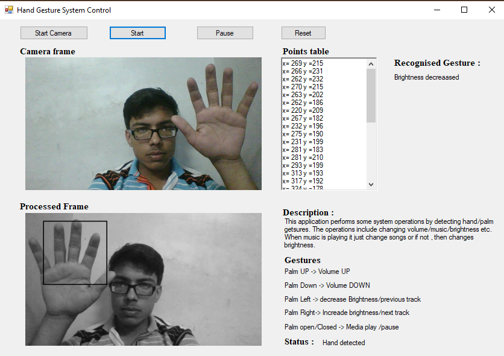

# Hand-Gesture-PC-Control
This is a Dot net Based windows application which uses EMGUCV(OPENCV wrapper for Dot net) for image processing. This application is designed for  real time tracking of hand gesture. The gestures are recorded using webcam. The main aim of this project is to create a natural interaction between human and computers in which recognized hand gestures can be used for performing some predefined system operations. This project uses cascade classifier for detecting hand from camera. After hand detection, the centroid is calculated then the motion of hand. If the motion of hand is matched with stored gesture, then the corresponding action is performed. 

# Images

#Libraries and API used
<li>  EMGUCV ->   <a href="www.emgu.com/">Go</a>
<li>  NIRCMD -> 	<a href="www.nirsoft.net/utils/nircmd.html">Go</a>
<li>	CSCORE ->    <a href="https://github.com/filoe/cscore">Go</a>
<li>	Virtual Keys ->   <a href="https://msdn.microsoft.com/en-us/library/windows/desktop/dd375731(v=vs.85).aspx>Go</a>

